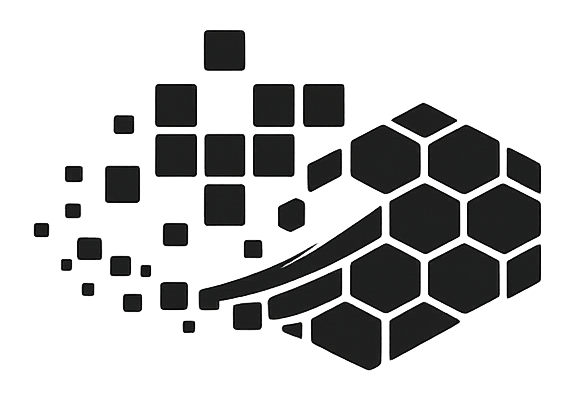

<p align="center">
  <picture>
    <source media="(prefers-color-scheme: dark)" srcset="assets/logo-white.png">
    <source media="(prefers-color-scheme: light)" srcset="assets/logo.png">
    
  </picture>
</p>

<h1 align="center">Javalution</h1>

<p align="center">
  <a href="https://www.oracle.com/java/">
    
  </a>
  <a href="https://openjfx.io/">
    
  </a>
  <a href="https://gradle.org/">
    
  </a>
</p>

<p align="center">
  Javalution is a high-performance Conway’s Game of Life simulator featuring a chunk-based grid for virtually infinite worlds, smooth zoom/pan rendering, and RLE pattern support.
</p>

## Key Features
- **Massive Grid:** Efficient chunk-based storage handles extremely large populations.
- **Fluid Rendering:** JavaFX Canvas with live zoom, panning, and grid toggling.
- **Multithreaded Engine:** Parallel generation updates for high-speed simulation.
- **RLE Support:** Load and parse standard Run-Length Encoded patterns.

## Controls
| Action | Input |
| :--- | :--- |
| **Draw/Place Cell** | Left Click / Drag |
| **Erase Cell** | Right Click / Drag |
| **Pan Camera** | Middle Click + Drag |
| **Zoom** | Scroll Wheel / `+` / `-` |
| **Play/Pause** | `Space` |
| **Step Forward** | `S` |
| **Clear Grid** | `C` |
| **Randomize** | `R` |

## Pattern Library
A set of example `.rle` patterns is included in the `patterns/` directory. You can load these using the **Load RLE** button in the application.

- `glider.rle`
- `pulsar.rle`
- `gosper_glider_gun.rle`

## Getting Started

### Prerequisites
- Java 25 (OpenJDK)
- **Java Version Management:** If you need to install or switch between Java versions, it is recommended to use [jvman](https://github.com/maskedsyntax/jvman).

### Installation
- **Linux (Debian/Ubuntu):** Download the `.deb` package from the [Releases](https://github.com/maskedsyntax/javalution/releases) page.
- **Linux (Fedora/RHEL):** Download the `.rpm` package from the [Releases](https://github.com/maskedsyntax/javalution/releases) page.
- **Arch Linux:** A `PKGBUILD` is available in the repository for building via `makepkg`.
- **Other Platforms:** Please follow the "Build and Run" instructions below to run from source.

### Build and Run
1. **Clone the repository:**
   ```bash
   git clone https://github.com/maskedsyntax/javalution.git
   cd javalution
   ```
2. **Launch the application:**
   ```bash
   ./gradlew run
   ```
3. **Build a JAR:**
   ```bash
   ./gradlew build
   ```
   The runnable JAR will be located in `build/libs/`.
